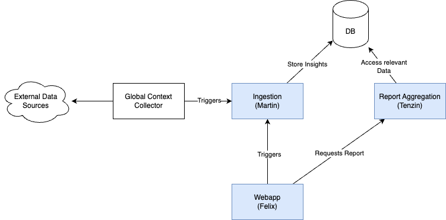

# Idea

A system to support the underwriters to asses a ceding insurers risk and determin the appropriate permiums.

the system consists of three parts: *(1) Ingestor*, recievs structured and unstructured data and extracts information such as YoY comparison, insights, etc.; *(2) Aggergator*, that collects all relevant information regarding the client, wording, and insights from the ingestion; *(3) Builder*, guides the underwriter to create the report.